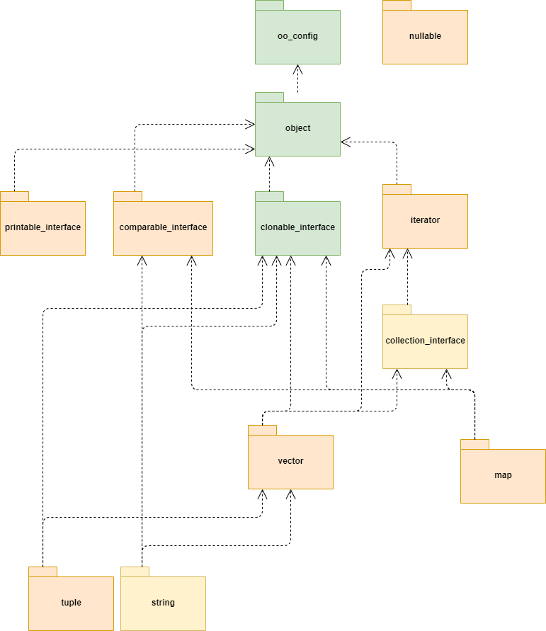

# object_oriented_c
An implementation of the "Object-Oriented Programming With ANSI-C" by Axel-Tobias Schreiner

## Brief explanation
This implementation is for educational purposes only. No support will be given to it. But feel free to contact me about any problems or just for discussing about it.

All the code has been previously tested and used before, this repository is being created to make it available for others.

For ease of use a new build system is being introduced and and each part is being tested using the gtest infrastructure.

## Structure and progress
The ooc library implemented is composed of many different parts shown in the image below. Later each of these parts will be properly described. 



The packages in green are already adapted and tested. The packages in orange are still to be done, and the packages in yellow are going to need some extra work and will probably be splitted into different packages.

## Build

To build the project run
```
mkdir build
cd build
cmake ..
make
``` 
To test it, after building, run on the build folder
```
ctest
```

You will need to have cmake installed.
Also, be sure to pull the project using the `--recurse-submodules` options
> `git clone --recurse-submodules ...`

For more details check the [git submodules page](https://git-scm.com/book/en/v2/Git-Tools-Submodules)
